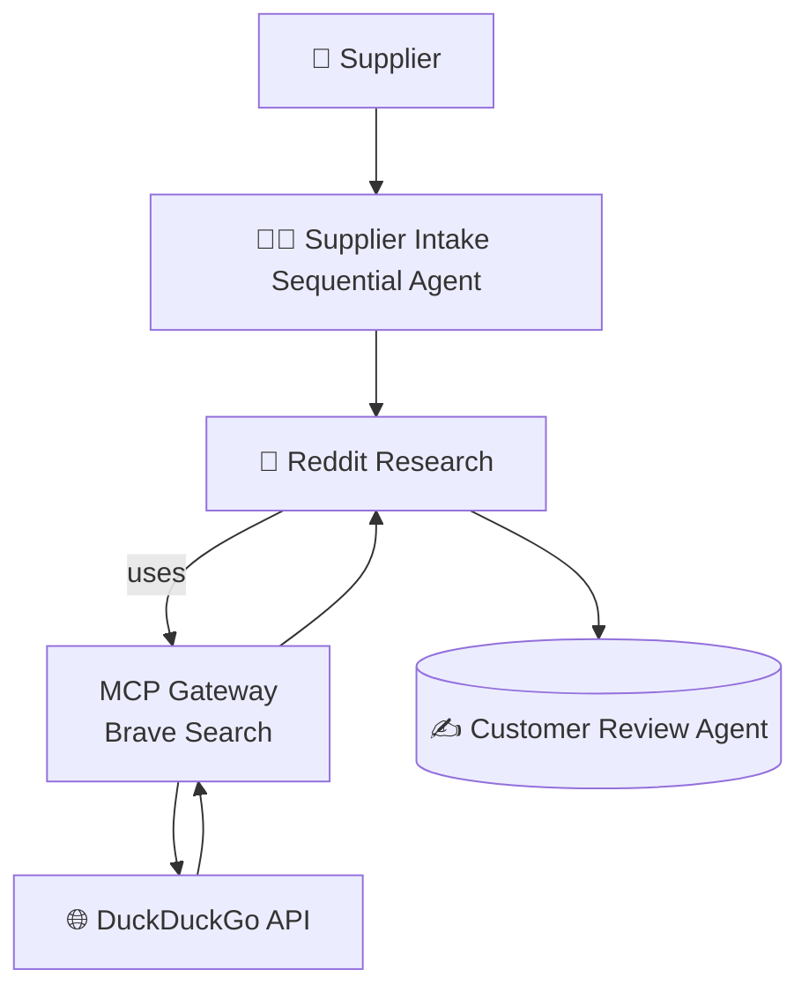

# 🧠 ADK Multi-Agent Fact Checker

> [!Tip]
> ✨ No configuration needed — run it with a single command.


# 🚀 Getting Started

### Requirements

- 🐳 [Docker Desktop] **v4.43.0+**

### Run the project

Some of the MCP servers used here require Secrets. Set the Brave and Reset api keys and then set the secrets for the gateway.

```sh
export BRAVE_API_KEY=<your_brave_api_key>
export RESEND_API_KEY=<resend_api_key>
make gateway-secrets
```

```sh
docker compose up --build
```

Using Docker Offload with GPU support, you can run the same demo with a larger model that takes advantage of a more powerful GPU on the remote instance:
```sh
docker compose -f compose.yaml -f compose.offload.yaml up --build
```

No configuration needed — everything runs from the container. Open `http://localhost:8080` in your browser to
chat with the agents.


# ❓ What Can It Do?

Example question:

> “"


# 🔧 Architecture Overview



# 🤝 Agent Roles

| **Agent**   | **Tools Used**        | **Role Description**                                                         |
| ----------- | --------------------- | ---------------------------------------------------------------------------- |
| **Supplier Intake**  | ❌ None                | Resesarches a new sock vendor and decides whether to onboard them to the store |
| **Reddit Research**  | ✅ BraveSearch via MCP | Searches for reviews on the vendor                             |
| **Customer Review**  | ❌ MongoDB             | Match styles against historical buyer data to see if it's a match for the store |
| **Catalog**          | ❌ curl                | Adds the product sku to the catalog if we like the product |

# 🧹 Cleanup

To stop and remove containers and volumes:

```sh
docker compose down -v
```


# 📎 Credits
- [ADK]
- [DuckDuckGo]
- [Docker Compose]

[ADK]: https://google.github.io/adk-docs/
[DuckDuckGo]: https://duckduckgo.com
[Docker Compose]: https://github.com/docker/compose
[Docker Desktop]: https://www.docker.com/products/docker-desktop/
