# 🧠 ADK Multi-Agent Fact Checker

> [!Tip]
> ✨ No configuration needed — run it with a single command.

# 🚀 Getting Started

### Requirements

- 🐳 [Docker Desktop] **v4.43.0+**

### Run the project

Some of the MCP servers used here require Secrets. Set the Brave and Reset api keys and then set the secrets for the gateway.

```sh
export BRAVE_API_KEY=<your_brave_api_key>
export RESEND_API_KEY=<resend_api_key>
export OPENAI_API_KEY=<openai_api_key>
make gateway-secrets
```
If you're running with an arm64 macos machine, then initialize the environment with one additional command:

```sh
DOCKER_DEFAULT_PLATFORM=linux/amd64 docker pull roberthouse224/catalogue
```

To start up the Sock Store and the Agent portal, run:

```sh
docker compose up --build
```

* Open [*http://localhost:9090*](http://localhost:9090) to see the sock store.
* Open [*http://localhost:3000*](http://localhost:3000) to see the Sock Vendor Agent Portal.


# ❓ What Can It Do?

Example input to the portal:

> “I am a sock vendor named Nike. Perhaps you've heard of us. We provide colorful compressions socks, that are elegant and affordable.  Our Nike compression socks are 12.99 each.  
   Here are some urls to images of the socks https://tinyurl.com/5n6spnvu and https://tinyurl.com/mv8ebjnh"

# 🔧 Architecture Overview

```mermaid

flowchart TD
    input[📝 Supplier] --> supplier_intake[🧑‍⚖️ Supplier Intake Sequential Agent]
    supplier_intake --> reddit_research[🧠 Reddit Research]
    reddit_research -->|uses| mcp[MCP Gateway<br/>Brave Search]
    mcp --> brave[🌐 DuckDuckGo API]
    brave --> mcp --> reddit_research
    reddit_research --> customer_review[(✍️ Customer Review Agent)]
```



# 🤝 Agent Roles

| **Agent**   | **Tools Used**        | **Role Description**                                                         |
| ----------- | --------------------- | ---------------------------------------------------------------------------- |
| **Supplier Intake**  |  None                | Resesarches a new sock vendor and decides whether to onboard them to the store |
| **Reddit Research**  |  BraveSearch via MCP | Searches for reviews on the vendor                             |
| **Customer Review**  |  MongoDB via MCP     | Match styles against historical buyer data to see if it's a match for the store |
| **Catalog**          |  curl via MCP        | Adds the product sku to the catalog if we like the product |

# 🧹 Cleanup

To stop and remove containers and volumes:

```sh
docker compose down -v
```

# 📎 Credits
- [ADK]
- [Docker Compose]

[ADK]: https://google.github.io/adk-docs/
[Docker Compose]: https://github.com/docker/compose
[Docker Desktop]: https://www.docker.com/products/docker-desktop/
