# 🧠 ADK Multi-Agent Fact Checker

This project demonstrates a **collaborative multi-agent system** built with the **Agent Development Kit** ([ADK]),
where a top-level Auditor agent coordinates the workflow to verify facts. The Critic agent gathers evidence
via live internet searches using **DuckDuckGo** through the Model Context Protocol (**MCP**), while the Reviser
agent analyzes and refines the conclusion using internal reasoning alone. The system showcases how agents
with distinct roles and tools can **collaborate under orchestration**.

> [!Tip]
> ✨ No configuration needed — run it with a single command.

<p align="center">
  
</p>

# 🚀 Getting Started

### Requirements

+ **[Docker Desktop] 4.43.0+ or [Docker Engine]** installed.
+ **A laptop or workstation with a GPU** (e.g., a MacBook) for running open models locally. If you
  don't have a GPU, you can alternatively use **[Docker Offload]**.
+ If you're using [Docker Engine] on Linux or [Docker Desktop] on Windows, ensure that the
  [Docker Model Runner requirements] are met (specifically that GPU
  support is enabled) and the necessary drivers are installed.
+ If you're using Docker Engine on Linux, ensure you have [Docker Compose] 2.38.1 or later installed.

### Run the project

```sh
docker compose up --build
```

Using Docker Offload with GPU support, you can run the same demo with a larger model that takes
advantage of a more powerful GPU on the remote instance:

```sh
docker compose -f compose.yaml -f compose.offload.yaml up --build
```

No configuration needed — everything runs from the container. Open `http://localhost:8080` in your
browser to chat with the agents.

# 🧠 Inference Options

By default, this project uses [Docker Model Runner] to handle LLM inference locally — no internet
connection or external API key is required.

If you’d prefer to use OpenAI instead:

1. Create a `secret.openai-api-key` file with your OpenAI API key:

    ```plaintext
    sk-...
    ```

2. Restart the project with the OpenAI configuration:

    ```sh
    docker compose down -v
    docker compose -f compose.yaml -f compose.openai.yaml up
    ```

# ❓ What Can It Do?

This system performs multi-agent fact verification, coordinated by an **Auditor**:

+ 🧑‍⚖️ **Auditor**:
  * Orchestrates the process from input to verdict.
  * Delegates tasks to Critic and Reviser agents.
+ 🧠 **Critic**:
  * Uses DuckDuckGo via MCP to gather real-time external evidence.
+ ✍️ **Reviser**:
  * Refines and verifies the Critic’s conclusions using only reasoning.

**🧠 All agents use the Docker Model Runner for LLM-based inference.**

Example question:

> “Is the universe infinite?"

# 🧱 Project Structure

| **File/Folder**      | **Purpose**                                                   |
| -------------------- | ------------------------------------------------------------- |
| `compose.yaml`       | Launches app and MCP DuckDuckGo Gateway                       |
| `Dockerfile`         | Builds the agent container                                    |
| `agents/agent.py`    | Auditor agent coordinating between the critic and the reviser |
| `agents/`            | Contains core logic for critic and reviser agents             |
| `agents/sub_agents/` | Submodules for critic and reviser roles                       |

# 🔧 Architecture Overview

```mermaid

flowchart TD
    input[📝 User Question] --> auditor[🧑‍⚖️ Auditor Sequential Agent]
    auditor --> critic[🧠 Critic Agent]
    critic -->|uses| mcp[MCP Gateway<br/>DuckDuckGo Search]
    mcp --> duck[🌐 DuckDuckGo API]
    duck --> mcp --> critic
    critic --> reviser[(✍️ Reviser Agent<br/>No tools)]
    auditor --> reviser
    reviser --> auditor
    auditor --> result[✅ Final Answer]

    critic -->|inference| model[(🧠 Docker Model Runner<br/>LLM)]
    reviser -->|inference| model

    subgraph Infra
      mcp
      model
    end

```



+ The Auditor is a Sequential Agent, it coordinates Critic and Reviser agents to verify user-provided claims.
+ The Critic agent performs live web searches through DuckDuckGo using an MCP-compatible gateway.
+ The Reviser agent refines the Critic’s conclusions using internal reasoning alone.
+ All agents run inference through a Docker-hosted Model Runner, enabling fully containerized LLM reasoning.

# 🤝 Agent Roles

| **Agent**   | **Tools Used**        | **Role Description**                                                         |
| ----------- | --------------------- | ---------------------------------------------------------------------------- |
| **Auditor** | ❌ None               | Coordinates the entire fact-checking workflow and delivers the final answer. |
| **Critic**  | ✅ DuckDuckGo via MCP | Gathers evidence to support or refute the claim                              |
| **Reviser** | ❌ None               | Refines and finalizes the answer without external input                      |

# 🧹 Cleanup

To stop and remove containers and volumes:

```sh
docker compose down -v
```

# 📎 Credits

+ [ADK]
+ [DuckDuckGo]
+ [Docker Compose]

[ADK]: https://google.github.io/adk-docs/
[DuckDuckGo]: https://duckduckgo.com
[Docker Compose]: https://github.com/docker/compose
[Docker Desktop]: https://www.docker.com/products/docker-desktop/
[Docker Engine]: https://docs.docker.com/engine/
[Docker Model Runner]: https://docs.docker.com/ai/model-runner/
[Docker Model Runner requirements]: https://docs.docker.com/ai/model-runner/
[Docker Offload]: https://www.docker.com/products/docker-offload/
