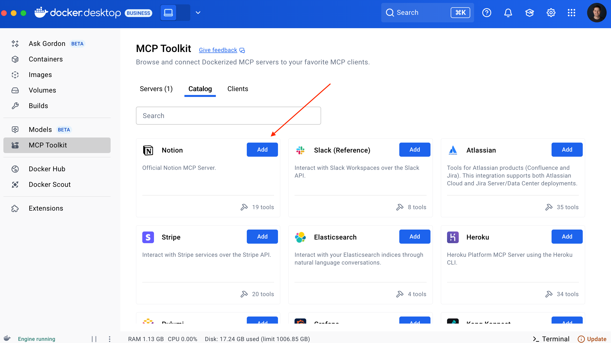
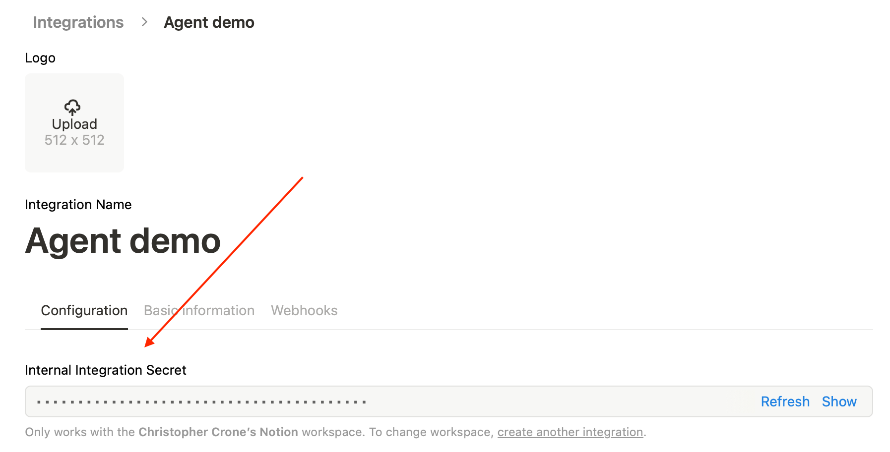
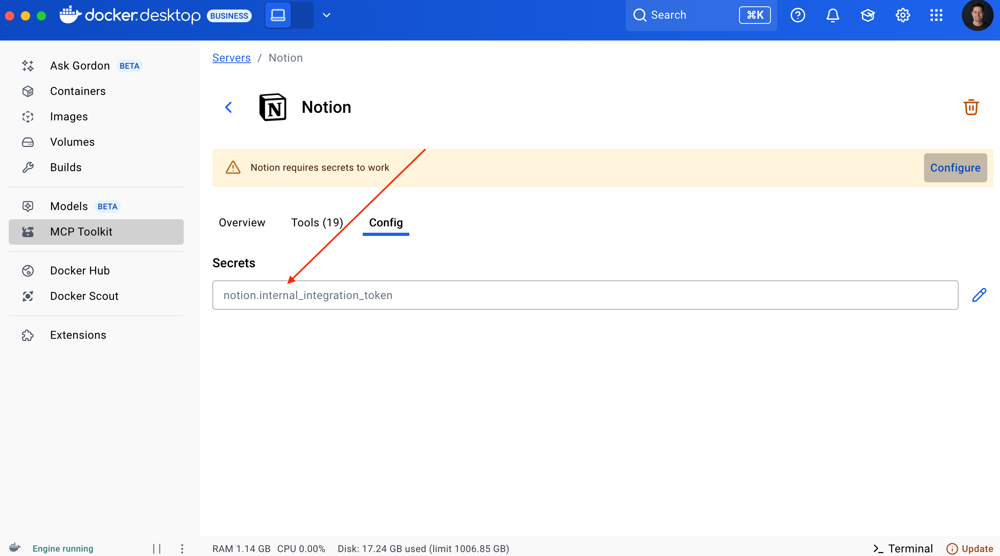
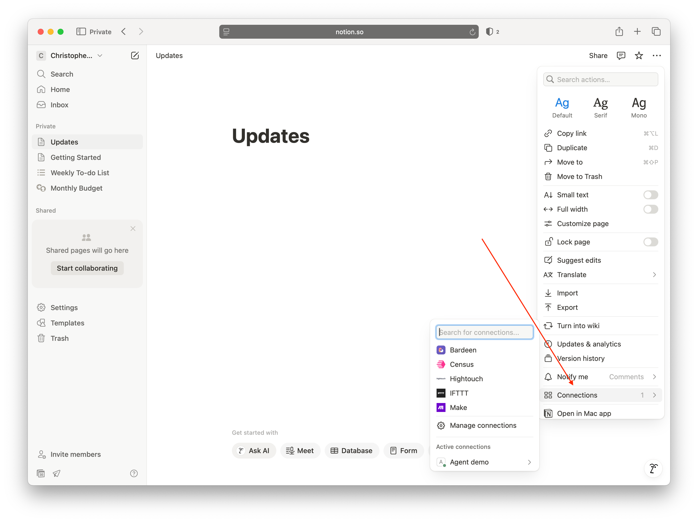

## OpenAI API Key

1. Generate a key by navigating to https://platform.openai.com/api-keys
1. Create a `.env` file and add your OpenAI API key to it:

```console
OPENAI_API_KEY=<KEY>
```

## MCP Server secrets

1. copy the `.mcp.env.example` to `.mcp.env` and then add both the Notion and the GitHub tokens to it.

### Notion

1. Create a new Notion account using a non-company email address
1. Create a new integration by navigating to https://www.notion.so/my-integrations
1. Follow the creation flow enabling write access
1. Add the Notion MCP Server in Docker Desktop

1. Copy the integration token into Desktop's MCP server configuration


1. Create a page named "Updates" in your workspace
1. Give your integration access to the page by clicking on the ... menu on the top right of the updates page, clicking "Connections" and selecting it

1. Add the token to the .mcp.env file.

### GitHub Official

1. Create a fine grained personal access token: https://github.com/settings/personal-access-tokens
1. Give it read access to public repos

1. Add the "GitHub Official" MCP server

1. Add your token to the .mcp.env file

## And Run!

Start the application:

```console
docker compose up --build
docker compose down --remove-orphans
```

**You can then see the agent UI on http://localhost:3000**

Try it out by typing a GitHub slug into the input box, for example:

```
summarize the issues in the repo slimslenderslacks/agent-demo
```
