# 🧠 Agno GitHub Issue Analyzer

This project demonstrates a **collaborative multi-agent system** built with [Agno], where specialized agents work together to analyze GitHub repositories. The **Coordinator** orchestrates the workflow between a **GitHub Issue Retriever** agent that fetches open issues via the **GitHub MCP Server**, and a **Writer** agent that summarizes and categorizes them into a comprehensive markdown report.

> [!Tip]
> ✨ No complex configuration needed — just add your GitHub token and run with a single command.

# 🚀 Getting Started

### Requirements

- 🐳 [Docker Desktop] **v4.43.0+**
- 🔑 GitHub Personal Access Token (for public repositories)

### Setup

1. **Create a GitHub Personal Access Token:**
   - Navigate to https://github.com/settings/personal-access-tokens
   - Create a fine-grained token with **read access to public repositories**

   

2. **Configure MCP secrets:**
   - Copy `.mcp.env.example` to `.mcp.env`
   - Add your GitHub token to the `.mcp.env` file:
   ```bash
   GITHUB_PERSONAL_ACCESS_TOKEN=your_token_here
   ```

### Run the Project

```sh
docker compose up --build
```

Using Docker Offload with GPU support, you can run the same demo with a larger model that takes advantage of a more powerful GPU on the remote instance:
```sh
docker compose -f compose.yaml -f compose.offload.yaml up --build
```

That's all! The agents will spin up automatically. Open **http://localhost:3000** in your browser to interact with the multi-agent system.

# ❓ What Can It Do?

Give it any public GitHub repository and watch the agents collaborate to deliver a comprehensive analysis:

- **Fetch Issues**: The GitHub agent retrieves all open issues with their details
- **Analyze & Categorize**: The Writer agent classifies issues into categories (bugs, features, documentation)
- **Generate Report**: Creates a structured markdown summary with issue links and descriptions

**Example queries:**
- `summarize the issues in the repo microsoft/vscode`
- `analyze issues in facebook/react`
- `categorize the problems in tensorflow/tensorflow`

The **Coordinator** orchestrates the entire workflow, ensuring each agent performs its specialized task efficiently.

# 👥 Agent Team Structure

| **Agent**                | **Role**                    | **Responsibilities**                                                    |
| ------------------------ | --------------------------- | ----------------------------------------------------------------------- |
| **Coordinator**          | 🎯 Team Orchestrator       | Coordinates workflow between GitHub retriever and Writer agents        |
| **GitHub Issue Retriever** | 🔍 Data Collector         | Fetches open issues from GitHub repositories via MCP                   |
| **Writer**               | ✍️ Content Analyst         | Summarizes, categorizes, and formats issues into markdown reports      |

# 🧱 Project Structure

| **File/Folder**    | **Purpose**                                                      |
| ------------------ | ---------------------------------------------------------------- |
| `compose.yaml`     | Orchestrates agents, UI, model runner, and MCP gateway          |
| `agents.yaml`      | Defines agent roles, instructions, and team coordination        |
| `agent/`           | Contains the Agno-based agent implementation                     |
| `agent-ui/`        | Next.js web interface for interacting with agents               |
| `.mcp.env`         | MCP server secrets (GitHub token)                               |

# 🔧 Architecture Overview

```mermaid
flowchart TD
    user[👤 User] -->|Repository query| ui[🖥️ Agent UI]
    ui --> coordinator[🎯 Coordinator Agent]

    coordinator --> github[🔍 GitHub Issue Retriever]
    coordinator --> writer[✍️ Writer Agent]

    github -->|fetches issues| mcp[MCP Gateway<br/>GitHub Official]
    mcp --> ghapi[📊 GitHub API]

    github -->|inference| model[(🧠 Docker Model Runner<br/>Qwen 3)]
    writer -->|inference| model
    coordinator -->|inference| model

    writer --> report[📄 Markdown Report<br/>Categorized Issues]
    report --> ui
    ui --> user

    subgraph Infrastructure
      mcp
      model
    end
```



- The **Coordinator** orchestrates the multi-agent workflow using Agno's team coordination
- **GitHub Issue Retriever** connects to GitHub via the secure MCP Gateway
- **Writer** processes and categorizes the retrieved data into structured reports
- All agents use **Docker Model Runner** with Qwen 3 for local LLM inference
- The **Next.js UI** provides an intuitive chat interface for repository analysis

# 🛠️ Agent Configuration

The agents are configured in `agents.yaml` with specific roles and instructions:

- **GitHub Agent**: Specialized in retrieving GitHub issues with precise API calls
- **Writer Agent**: Expert in summarization and categorization with markdown formatting
- **Coordinator Team**: Orchestrates the workflow between specialized agents

Each agent uses the **Docker Model Runner** for inference, ensuring consistent performance without external API dependencies.

# 🧹 Cleanup

To stop and remove containers and volumes:

```sh
docker compose down -v
```

# 📎 Credits

- [Agno] - Multi-agent framework
- [GitHub MCP Server] - Model Context Protocol integration
- [Docker Compose] - Container orchestration

[Agno]: https://github.com/agno-ai/agno
[GitHub MCP Server]: https://github.com/modelcontextprotocol/servers
[Docker Compose]: https://github.com/docker/compose
[Docker Desktop]: https://www.docker.com/products/docker-desktop/
