# 🧠 Agno GitHub Issue Analyzer

This project demonstrates a **collaborative multi-agent system** built with [Agno], where specialized
agents work together to analyze GitHub repositories. The **Coordinator** orchestrates the workflow
between a **GitHub Issue Retriever** agent that fetches open issues via the **GitHub MCP Server**, and
a **Writer** agent that summarizes and categorizes them into a comprehensive markdown report.

> [!Tip]
> ✨ No complex configuration needed — just add your GitHub token and run with a single command.

# 🚀 Getting Started

### Requirements

+ **[Docker Desktop] 4.43.0+ or [Docker Engine]** installed.
+ **A laptop or workstation with a GPU** (e.g., a MacBook) for running open models locally. If you
  don't have a GPU, you can alternatively use **[Docker Offload]**.
+ If you're using [Docker Engine] on Linux or [Docker Desktop] on Windows, ensure that the
  [Docker Model Runner requirements] are met (specifically that GPU
  support is enabled) and the necessary drivers are installed.
+ If you're using Docker Engine on Linux, ensure you have [Docker Compose] 2.38.1 or later installed.
+ 🔑 GitHub Personal Access Token (for public repositories)

### Setup

1. **Create a GitHub Personal Access Token:**
   - Navigate to <https://github.com/settings/personal-access-tokens>
   - Create a fine-grained token with **read access to public repositories**

   

2. **Configure MCP secrets:**
   - Copy `.mcp.env.example` to `.mcp.env`
   - Add your GitHub token to the `.mcp.env` file:
  
   ```sh
   GITHUB_PERSONAL_ACCESS_TOKEN=your_token_here
   ```

### Run the Project

```sh
docker compose up --build
```

Using Docker Offload with GPU support, you can run the same demo with a larger model that takes advantage
of a more powerful GPU on the remote instance:

```sh
docker compose -f compose.yaml -f compose.offload.yaml up --build
```

That's all! The agents will spin up automatically. Open **<http://localhost:3000>** in your browser to
interact with the multi-agent system.

# 🧠 Inference Options

By default, this project uses [Docker Model Runner] to handle LLM inference locally — no internet
connection or external API key is required.

If you’d prefer to use OpenAI instead:

1. Create a `secret.openai-api-key` file with your OpenAI API key:

      ```plaintext
      sk-...
      ```

2. Restart the project with the OpenAI configuration:

      ```sh
      docker compose down -v
      docker compose -f compose.yaml -f compose.openai.yaml up
      ```

# ❓ What Can It Do?

Give it any public GitHub repository and watch the agents collaborate to deliver a comprehensive analysis:

+ **Fetch Issues**: The GitHub agent retrieves all open issues with their details
+ **Analyze & Categorize**: The Writer agent classifies issues into categories (bugs, features, documentation)
+ **Generate Report**: Creates a structured markdown summary with issue links and descriptions

**Example queries:**

+ `summarize the issues in the repo microsoft/vscode`
+ `analyze issues in facebook/react`
+ `categorize the problems in tensorflow/tensorflow`

The **Coordinator** orchestrates the entire workflow, ensuring each agent performs its specialized task efficiently.

# 👥 Agent Team Structure

| **Agent**                | **Role**                    | **Responsibilities**                                                    |
| ------------------------ | --------------------------- | ----------------------------------------------------------------------- |
| **Coordinator**          | 🎯 Team Orchestrator       | Coordinates workflow between GitHub retriever and Writer agents        |
| **GitHub Issue Retriever** | 🔍 Data Collector         | Fetches open issues from GitHub repositories via MCP                   |
| **Writer**               | ✍️ Content Analyst         | Summarizes, categorizes, and formats issues into markdown reports      |

# 🧱 Project Structure

| **File/Folder**    | **Purpose**                                                      |
| ------------------ | ---------------------------------------------------------------- |
| `compose.yaml`     | Orchestrates agents, UI, model runner, and MCP gateway          |
| `agents.yaml`      | Defines agent roles, instructions, and team coordination        |
| `agent/`           | Contains the Agno-based agent implementation                     |
| `agent-ui/`        | Next.js web interface for interacting with agents               |
| `.mcp.env`         | MCP server secrets (GitHub token)                               |

# 🔧 Architecture Overview

```mermaid
flowchart TD
    user[👤 User] -->|Repository query| ui[🖥️ Agent UI]
    ui --> coordinator[🎯 Coordinator Agent]

    coordinator --> github[🔍 GitHub Issue Retriever]
    coordinator --> writer[✍️ Writer Agent]

    github -->|fetches issues| mcp[MCP Gateway<br/>GitHub Official]
    mcp --> ghapi[📊 GitHub API]

    github -->|inference| model[(🧠 Docker Model Runner<br/>Qwen 3)]
    writer -->|inference| model
    coordinator -->|inference| model

    writer --> report[📄 Markdown Report<br/>Categorized Issues]
    report --> ui
    ui --> user

    subgraph Infrastructure
      mcp
      model
    end
```



+ The **Coordinator** orchestrates the multi-agent workflow using Agno's team coordination
+ **GitHub Issue Retriever** connects to GitHub via the secure MCP Gateway
+ **Writer** processes and categorizes the retrieved data into structured reports
+ All agents use **[Docker Model Runner]** with Qwen 3 for local LLM inference
+ The **Next.js UI** provides an intuitive chat interface for repository analysis

# 🛠️ Agent Configuration

The agents are configured in `agents.yaml` with specific roles and instructions:

+ **GitHub Agent**: Specialized in retrieving GitHub issues with precise API calls
+ **Writer Agent**: Expert in summarization and categorization with markdown formatting
+ **Coordinator Team**: Orchestrates the workflow between specialized agents

Each agent uses the **[Docker Model Runner]** for inference, ensuring consistent performance without
external API dependencies.

# 🧹 Cleanup

To stop and remove containers and volumes:

```sh
docker compose down -v
```

# 📎 Credits

+ [Agno] - Multi-agent framework
+ [GitHub MCP Server] - Model Context Protocol integration
+ [Docker Compose] - Container orchestration

[Agno]: https://github.com/agno-agi/agno
[GitHub MCP Server]: https://github.com/modelcontextprotocol/servers
[Docker Compose]: https://github.com/docker/compose
[Docker Desktop]: https://www.docker.com/products/docker-desktop/
[Docker Engine]: https://docs.docker.com/engine/
[Docker Model Runner]: https://docs.docker.com/ai/model-runner/
[Docker Model Runner requirements]: https://docs.docker.com/ai/model-runner/
[Docker Offload]: https://www.docker.com/products/docker-offload/
