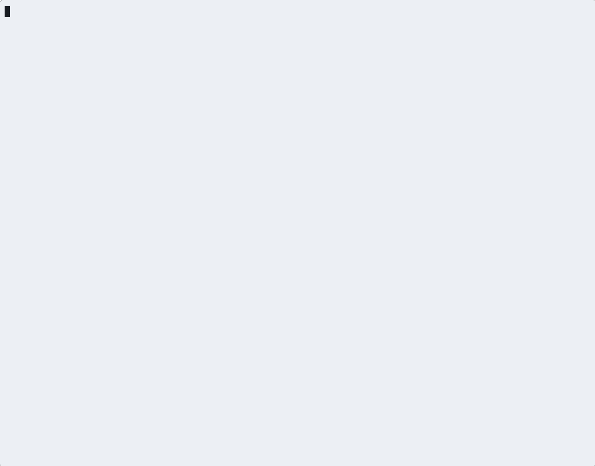
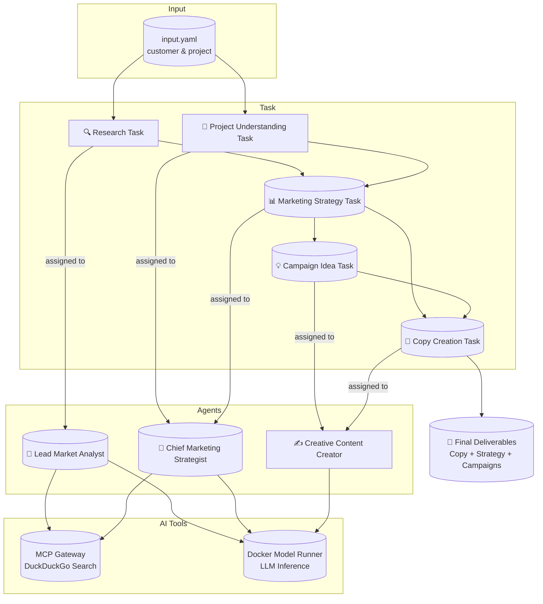

# 🧠 CrewAI Marketing Team Demo

This project showcases an autonomous, multi-agent **virtual marketing team** built with
[CrewAI](https://github.com/joaomdmoura/crewAI). It automates the creation of a high-quality, end-to-end marketing strategy — from research to copywriting — using task delegation, web search, and creative synthesis.

> [!Tip]
> ✨ No configuration needed — run it with a single command.


<p align="center">
  
</p>

## 🚀 Getting Started

### Requirements

- ✅ [Docker Desktop] **v4.43.0+**

### Run the Project

```sh
docker compose up
```

That’s all. The agents will spin up and collaborate through a series of predefined roles and tasks to
deliver a complete marketing strategy for the input project.


## ❓ What Can It Do?

Give it a company and a project description — the agents will collaborate to produce a full marketing strategy:

- “Research the market landscape around CrewAI’s automation tools.”
- “Understand the target audience for enterprise AI integrations.”
- “Formulate a high-impact marketing strategy with KPIs and channels.”
- “Propose 5 creative campaigns tailored to tech decision-makers.”
- “Write compelling ad copy for each campaign idea.”

From strategy to storytelling, the team handles it all — autonomously.

You can **customize the tasks** to use your own domain and project description — just edit the inputs in `src/config/inputs.yaml`.


# 👥 Virtual Team Structure

| **Agent**                      | **Role**                       | **Responsibilities**                                                   |
| ------------------------------ | ------------------------------ | ---------------------------------------------------------------------- |
| **Lead Market Analyst**        | 🧠 lead_market_analyst        | Performs in-depth research on the customer, competitors, and audience. |
| **Chief Marketing Strategist** | 🎯 chief_marketing_strategist | Designs the complete marketing strategy using team insights.           |
| **Creative Content Creator**   | ✍️ creative_content_creator  | Writes compelling ad copy based on campaign ideas.                     |
| **Chief Creative Director**    | 👑 chief_creative_director    | Reviews and approves all outputs for alignment and quality.            |


# 🧱 Project Structure

| File/Folder    | Purpose                                                |
| -------------- | ------------------------------------------------------ |
| `compose.yaml` | Defines service orchestration.                         |
| `Dockerfile`   | Builds the container environment.                      |
| `src/config`   | Contains the agent, task definitions, and task inputs. |
| `src/*.py`     | Main program and crew definition.                      |


# 🔧 Architecture Overview



- The LangGraph-based agent transforms questions into SQL.
- PostgreSQL is populated from a SQLite dump at runtime.
- All components are fully containerized for plug-and-play usage.


# 🧹 Cleanup

To stop and remove containers and volumes:

```sh
docker compose down -v
```


# 📎 Credits
- [crewAI]
- [DuckDuckGo]
- [Docker Compose]


[crewAI]: https://github.com/crewAIInc/crewAI
[DuckDuckGo]: https://duckduckgo.com
[Docker Compose]: https://github.com/docker/compose
[Docker Desktop]: https://www.docker.com/products/docker-desktop/
