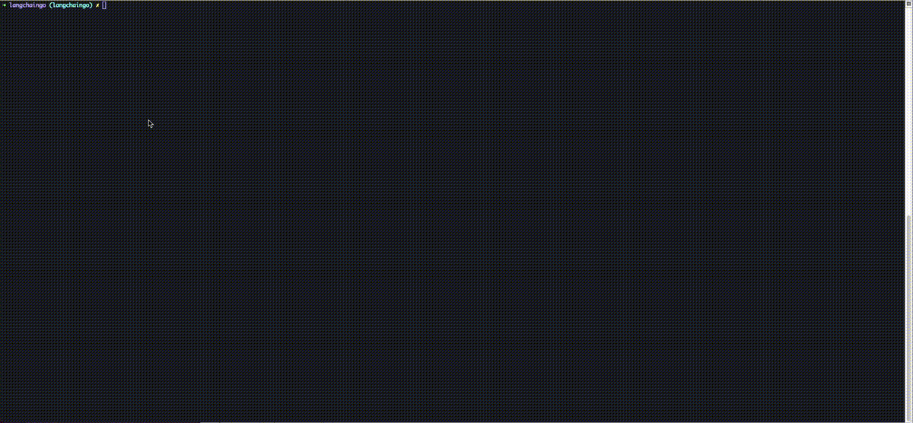
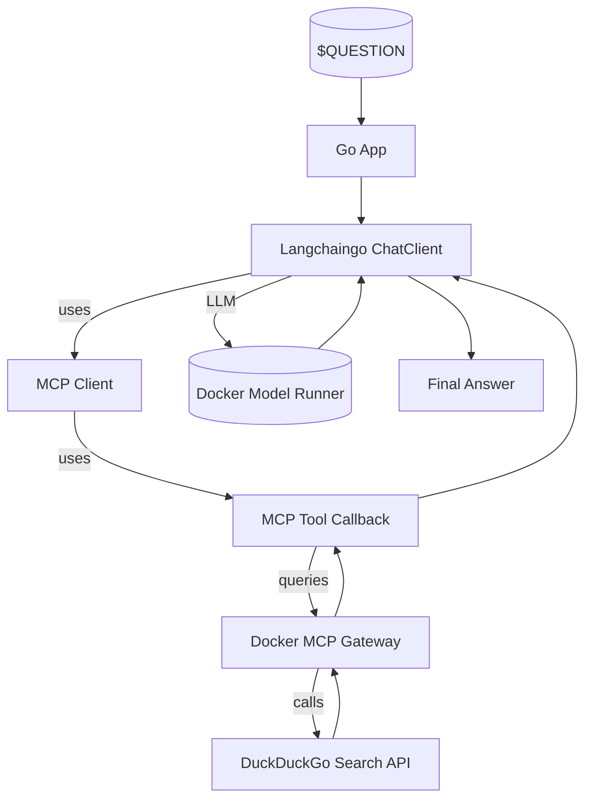

# 🧠 Langchaingo + DuckDuckGo with Model Context Protocol (MCP)

This project demonstrates a **zero-config application** using [Langchaingo] and
the **Model Context Protocol (MCP)** to answer natural language questions by performing
real-time web search via [DuckDuckGo] — all orchestrated with [Docker Compose].

> [!Tip]
> ✨ No configuration needed — run it with a single command.

<p align="center">
  
</p>

# 🚀 Getting Started

### Requirements

+ **[Docker Desktop] 4.43.0+ or [Docker Engine]** installed.
+ **A laptop or workstation with a GPU** (e.g., a MacBook) for running open models locally. If you
  don't have a GPU, you can alternatively use **[Docker Offload]**.
+ If you're using [Docker Engine] on Linux or [Docker Desktop] on Windows, ensure that the
  [Docker Model Runner requirements] are met (specifically that GPU
  support is enabled) and the necessary drivers are installed.
+ If you're using Docker Engine on Linux, ensure you have [Docker Compose] 2.38.1 or later installed.

### Run the project

```sh
docker compose up
```

No setup, API keys, or additional configuration required.

### Test the project

```sh
go test -v ./...
```

This command runs all the tests in the project, using [Testcontainers Go] to spin up the different
containers needed for the tests:

1. [Docker Model Runner]: a socat container to forward the model runner's API to the test process.
It allows to talk to the local LLM models, provided by [Docker Desktop], from the test process.
2. [Docker MCP Gateway]: Docker's MCP gateway container to facilitate the access to the MCP servers and tools.
It allows to talk to the MCP servers provided by [Docker Desktop], in this case DuckDuckGo, from the test process.

No port conflicts happen, thanks to the [Testcontainers Go] library, which automatically exposes the known ports
of the containers on a random, free port in the host. Therefore, you can run the tests as many times as you want,
even without stopping the Docker Compose application.

All containers started by [Testcontainers Go] are automatically cleaned up after the tests finish,
so you don't need to worry about cleaning them up manually.

#### String comparison tests

This test is a simple test that checks if the answer is correct by comparing it to a reference answer.
As you can imagine, given the non-deterministic nature of the LLM, this check is not very robust.

Run this test with:

```sh
go test -v -run TestChat_stringComparison ./...
```

#### Cosine similarity tests

This test is a more robust test that checks if the answer is correct by using the cosine similarity
between the reference answer and the answer of the model. To calculate the cosine similarity,
the test obtains the embeddings of the reference answer and the answer of the model,
and then calculates the cosine similarity between them. If the result is greater than a threshold,
which is defined by the team, the test is considered to be passed.

Run this test with:

```sh
go test -v -run TestChat_embeddings ./...
```

#### RAG tests

This test is a more robust test that checks if the answer is correct by using the RAG technique.
It creates a Weaviate store to store the content that will serve as a reference, and it uses the built-in mechanisms
in the Vector Database to obtain the most relevant documents to the question. Then, it includes
those relevant documents in the prompt of the LLM to answer the question.

Run this test with:

```sh
go test -v -run TestChat_rag ./...
```

#### Evaluator tests

This test uses the concept of [LLM-as-a-judge] to evaluate the accuracy of the answer. It creates an evaluator,
using another LLM, maybe with a more specialised, different model, to evaluate the accuracy of the answer.
For that, it uses a strict system message and a user message that forces the LLM to return a JSON object
with the following fields:

+ "provided_answer": the answer to the question
+ "is_correct": true if the answer is correct, false otherwise
+ "reasoning": the reasoning behind the answer
The response should be a valid JSON object.

Run this test with:

```sh
go test -v -run TestChat_usingEvaluator ./...
```

# 🧠 Inference Options

By default, this project uses [Docker Model Runner] to handle LLM inference locally — no internet
connection or external API key is required.

If you’d prefer to use OpenAI instead:

1. Create a `secret.openai-api-key` file with your OpenAI API key:

    ```plaintext
    sk-...
    ```

2. Restart the project with the OpenAI configuration:

    ```sh
    docker compose down -v
    docker compose -f compose.yaml -f compose.openai.yaml up
    ```

# ❓ What Can It Do?

Ask natural language questions and let Langchaingo + DuckDuckGo Search provide intelligent, real-time answers:

+ “Does Langchaingo support the Model Context Protocol?”
+ “What is the Brave Search API?”
+ “Give me examples of Langchaingo integrations.”

The application uses:

+ A MCP-compatible gateway to route queries to DuckDuckGo Search
+ Langchaingo’s LLM client to embed results into answers
+ An MCP client to call tools, using the [Model Context Protocol's Go SDK].

To **customize the question** asked to the agent, edit the `QUESTION` environment variable in `compose.yaml`.

# 🧱 Project Structure

| **File/Folder**          | **Purpose**                                      |
| ------------------------ | ------------------------------------------------ |
| `compose.yaml`           | launches the DuckDuckGo MCP gateway and app |
| `Dockerfile`             | Builds the Go container                 |
| `main.go`                | Configures the ChatClient with MCP and runs it |
| `tool_duckduck.go`       | Implements the DuckDuckGo tool |

# 🔧 Architecture Overview



+ The application loads a question via the `QUESTION` environment variable.
+ MCP is used as a tool in the LLM pipeline.
+ The response is enriched with real-time DuckDuckGo Search results.

# 📎 Credits

+ [Langchaingo]
+ [DuckDuckGo]
+ [Docker Compose]
+ [Testcontainers Go]

[DuckDuckGo]: https://duckduckgo.com
[Langchaingo]: https://github.com/tmc/langchaingo
[LLM-as-a-judge]: https://eugeneyan.com/writing/llm-evaluators/
[Testcontainers Go]: https://github.com/testcontainers/testcontainers-go
[Model Context Protocol's Go SDK]: https://github.com/modelcontextprotocol/go-sdk/
[Docker Compose]: https://github.com/docker/compose
[Docker Desktop]: https://www.docker.com/products/docker-desktop/
[Docker Engine]: https://docs.docker.com/engine/
[Docker Model Runner]: https://docs.docker.com/ai/model-runner/
[Docker MCP Gateway]: https://docs.docker.com/ai/mcp-gateway/
[Docker Model Runner requirements]: https://docs.docker.com/ai/model-runner/
[Docker Offload]: https://www.docker.com/products/docker-offload/
