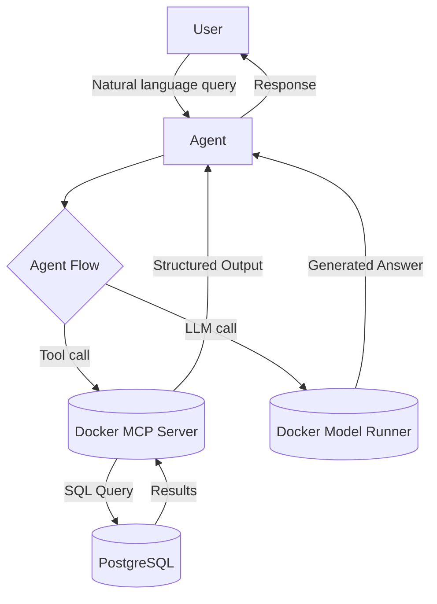

# 🧠 SQL Agent with LangGraph

This project demonstrates a **zero-config AI agent** that uses [LangGraph] to answer natural language questions by querying a SQL database — all orchestrated with [Docker Compose].

> [!Tip]
> ✨ No configuration needed — run it with a single command.


<p align="center">
  
</p>

# 🚀 Getting Started

### Requirements

- 🐳 [Docker Desktop] **v4.43.0+**

### Run the project


```sh
docker compose up
```

That’s all. The agent spins up automatically, sets up PostgreSQL, loads a pre-seeded database (`Chinook.db`), and starts answering your questions.

# 🧠 Inference Options

By default, this project uses [Docker Model Runner] to handle LLM inference locally — no internet connection or external API key is required.

If you’d prefer to use OpenAI instead:

1. Create a `secret.openai-api-key` file with your OpenAI API key:

```
sk-...
```

2. Restart the project with the OpenAI configuration:

```
docker compose down -v
docker compose -f compose.yaml -f compose.openai.yaml up
```

# ❓ What Can It Do?

The project lets you explore the [Chinkook database](https://github.com/lerocha/chinook-database) using natural language. This database represents a digital media store with information regarding artists, albums, media tracks, invoices, and customers.

The agent will write the SQL for your natural language questions:
- “Who was the best-selling sales agent in 2010?”
- “List the top 3 albums by sales.”
- “How many customers are from Brazil?”

You can **customize the initial question** asked by the agent — just edit the question in `compose.yaml`.

Need to work with a **different dataset?** Simply swap out `Chinook.db` with your own SQLite file and update the mount path in `compose.yaml`.


# 🧱 Project Structure

| File/Folder    | Purpose                                                                   |
| -------------- | ------------------------------------------------------------------------- |
| `compose.yaml` | Defines service orchestration and database import (from SQLite).          |
| `Dockerfile`   | Builds the container environment.                                         |
| `agent.py`     | Contains the LangGraph agent and logic for forming and answering queries. |
| `Chinook.db`   | Example SQLite database — can be replaced with your own.                  |


# 🔧 Architecture Overview



- The LangGraph-based agent transforms questions into SQL.
- PostgreSQL is populated from a SQLite dump at runtime.
- All components are fully containerized for plug-and-play usage.


# 🧹 Cleanup

To stop and remove containers and volumes:

```sh
docker compose down -v
```


# 📎 Credits
- [LangGraph]
- [PostgreSQL]
- [Docker Compose]


[LangGraph]: https://github.com/langchain-ai/langgraph
[PostgreSQL]: https://postgresql.org
[Docker Compose]: https://github.com/docker/compose
[Docker Desktop]: https://www.docker.com/products/docker-desktop/
[Docker Model Runner]: https://docs.docker.com/ai/model-runner/
