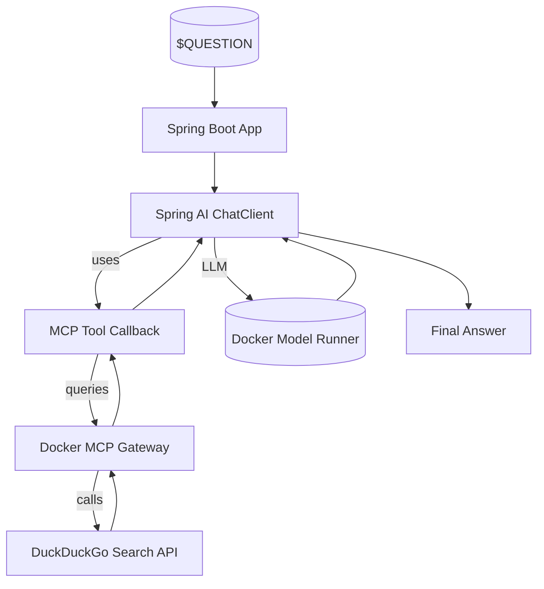

# 🧠 Spring AI + DuckDuckGo with Model Context Protocol (MCP)

This project demonstrates a **zero-config Spring Boot application** using [Spring AI] and the **Model Context Protocol (MCP)** to answer natural language questions by performing real-time web search via [DuckDuckGo] — all orchestrated with [Docker Compose].

> [!Tip]
> ✨ No configuration needed — run it with a single command.

<p align="center">
  
</p>


# 🚀 Getting Started

### Requirements

+ **[Docker Desktop](https://www.docker.com/products/docker-desktop/) 4.43.0+ or [Docker Engine](https://docs.docker.com/engine/)** installed
+ **A laptop or workstation with a GPU** (e.g., a MacBook) for running open models locally. If you don't have a GPU, you can alternatively use [**Docker Offload**](https://www.docker.com/products/docker-offload).
+ If you're using Docker Engine on Linux or Docker Desktop on Windows, ensure that the [Docker Model Runner requirements](https://docs.docker.com/ai/model-runner/) are met (specifically that GPU support is enabled) and the necessary drivers are installed
+ If you're using Docker Engine on Linux, ensure you have Compose 2.38.1 or later installed

### Run the project

```sh
docker compose up
```

No setup, API keys, or additional configuration required.

# 🧠 Inference Options

By default, this project uses [Docker Model Runner] to handle LLM inference locally — no internet connection or external API key is required.

If you’d prefer to use OpenAI instead:

1. Create a `secret.openai-api-key` file with your OpenAI API key:

```
sk-...
```

2. Restart the project with the OpenAI configuration:

```
docker compose down -v
docker compose -f compose.yaml -f compose.openai.yaml up
```

# ❓ What Can It Do?

Ask natural language questions and let Spring AI + DuckDuckGo Search provide intelligent, real-time answers:

- “Does Spring AI support the Model Context Protocol?”
- “What is the Brave Search API?”
- “Give me examples of Spring Boot AI integrations.”

The application uses:
- A MCP-compatible gateway to route queries to DuckDuckGo Search
- Spring AI’s LLM client to embed results into answers
- Auto-configuration via Spring Boot to bind everything

To **customize the question** asked to the agent, edit the `QUESTION` environment variable in `compose.yaml`.

# 🧱 Project Structure

| **File/Folder**          | **Purpose**                                      |
| ------------------------ | ------------------------------------------------ |
| `compose.yaml`           | launches the DuckDuckGo MCP gateway and Spring AI app |
| `Dockerfile`             | Builds the Spring Boot container                 |
| `application.properties` | Sets the MCP gateway URL used by Spring AI       |
| `Application.java`       | Configures the ChatClient with MCP and runs it   |
| `mvnw`, `pom.xml`        | Maven wrapper and build definition               |

# 🔧 Architecture Overview



- The application loads a question via the `QUESTION` environment variable.
- MCP is used as a tool in the LLM pipeline.
- The response is enriched with real-time DuckDuckGo Search results.

# 📎 Credits

- [Spring AI]
- [DuckDuckGo]
- [Docker Compose]

[DuckDuckGo]: https://duckduckgo.com
[Spring AI]: https://github.com/spring-projects/spring-ai
[Docker Compose]: https://docs.docker.com/compose/
[Docker Desktop]: https://www.docker.com/products/docker-desktop/
[Docker Model Runner]: https://docs.docker.com/ai/model-runner/
